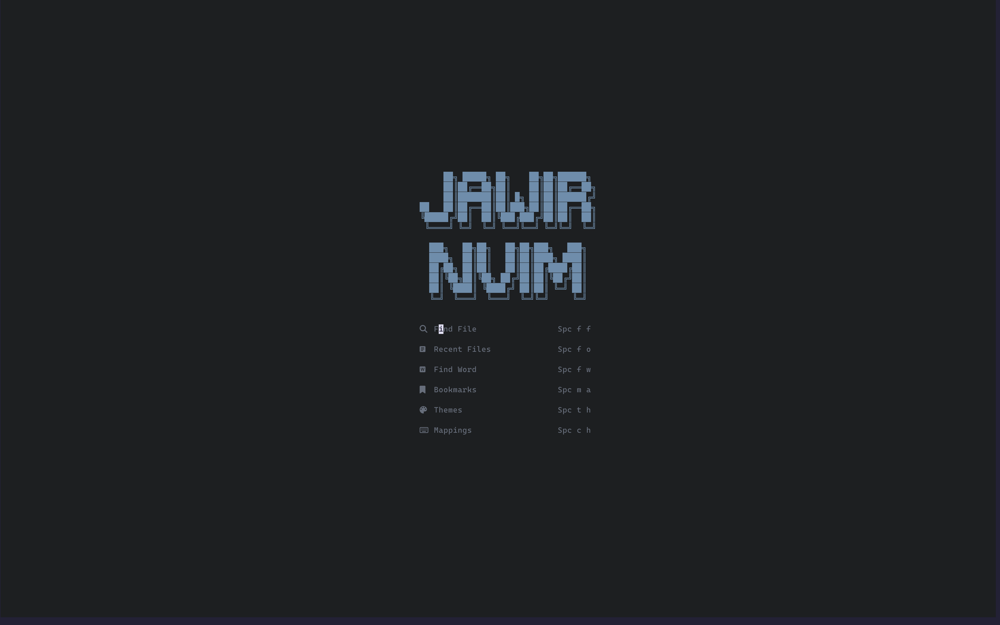
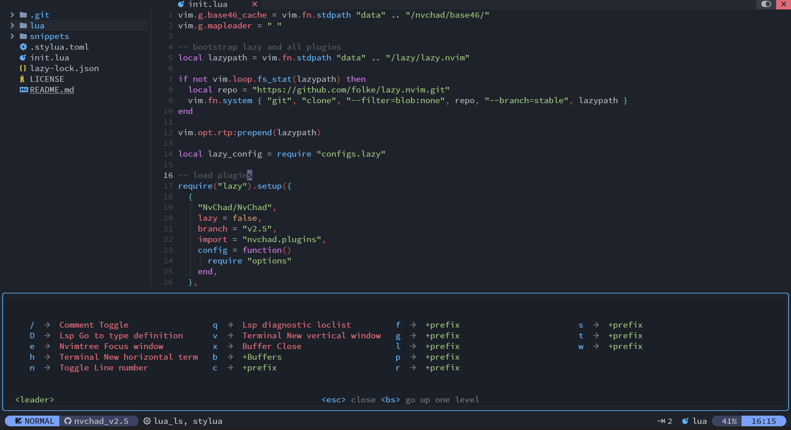

# starter

Starter config for Jawir Nvim
 
## HOME



## CODE



- Linux :

```bash
git clone https://github.com/Aex5/Jawir-Neovim.git ~/.config/nvim
```

- Windows

```pwsh
git clone https://github.com/Aex5/Jawir-Neovim.git "$env:LOCALAPPDATA\nvim"
```
